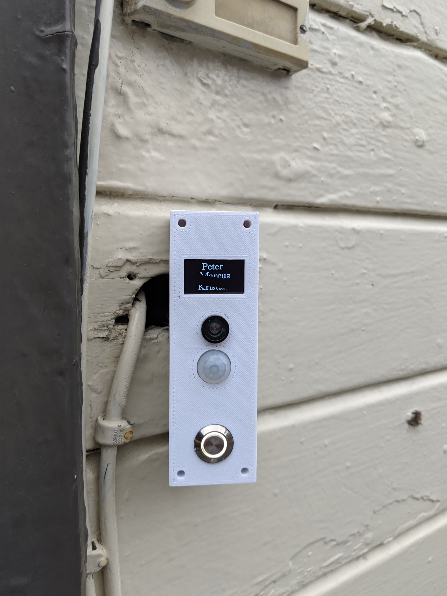
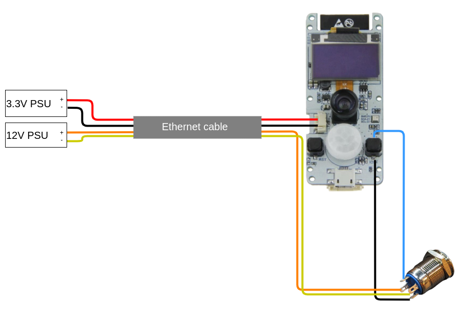
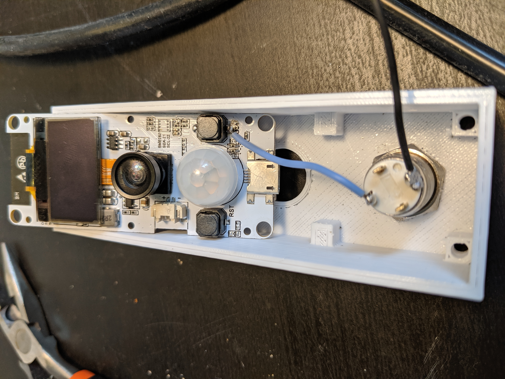
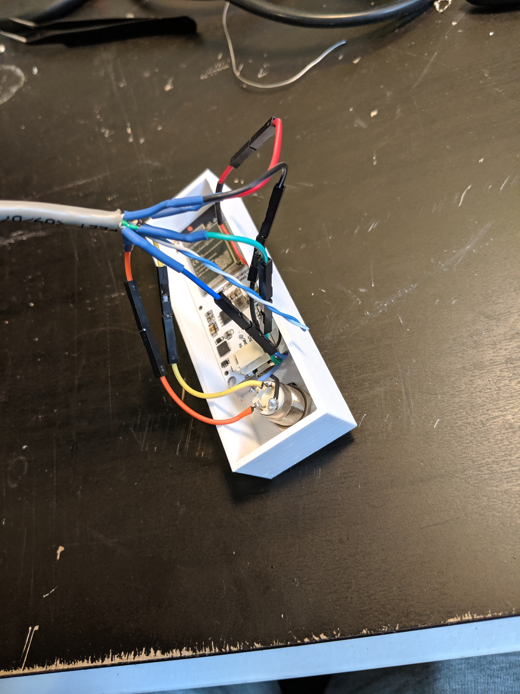
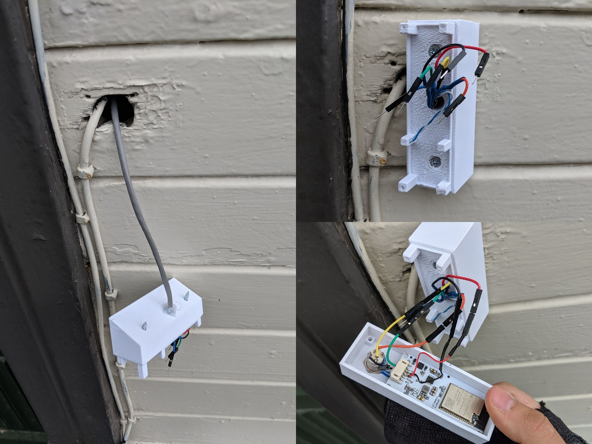
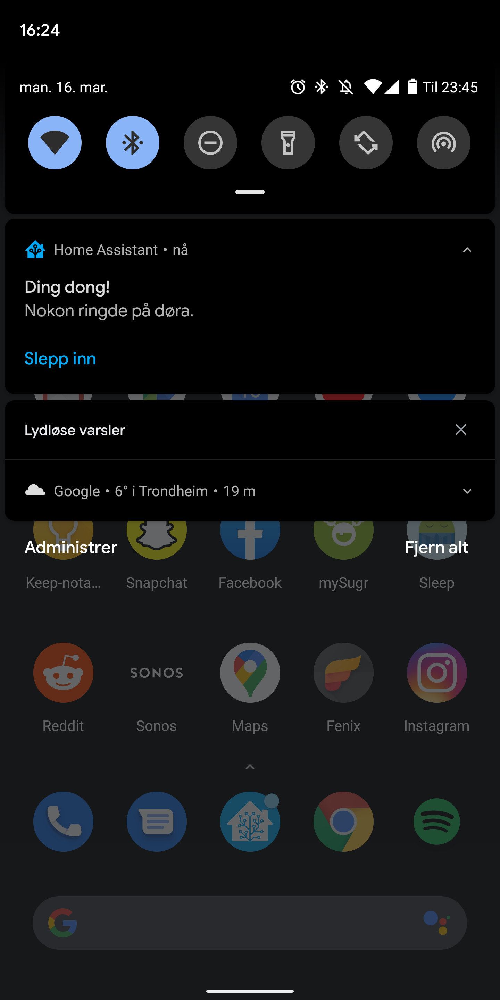

# ESPHome-Doorbell

Affordable and easy to make video doorbell for [Home Assistant](https://www.home-assistant.io) using [ESPHome](https://www.esphome.io)!

### Features:

- No cloud services needed
- Made with [ESPHome](https://www.esphome.io) which makes it easy to code and modify for your needs
- Illuminated button which makes it easy to see where to press
- Display which can display your households name or anything really
- Fisheye lens which gives a wide feild of view
- Native camera stream into Home Assistant
- Other powerful possibilities with Home Assistant

## Parts needed

| Part                         | Price   | Comment                                         |
|------------------------------|---------|-------------------------------------------------|
| LILYGO TTGO T-Camera ESP32   | 15$     | Get the fisheye option!                         |
| Illuminated Momentary Button | 1$      | Needs to be 12 mm. Pick the color you like. 12V |
| M3 x 16mm                    | idk     |                                                 |
| 4 chord wire                 | idk     | A regular Ethernet cable would do               |
| 12V PSU                      | idk     | I'm sure you have something laying around.      |
| 3.3V PSU                     | idk     |                                                 |

Since I ended up having much of what I needed already laying around, I do not have a completely full bill of materials. But 16$ + some idk = approx 20$? 

## How
- Flash your ESP32. [Here is my ESPHome code](https://github.com/petrepa/ESPHome-Doorbell/blob/master/esphome_doorbell.yaml)
- Print the parts. 
  - [Printables](https://www.printables.com/model/222620-ttgo-t-camera-video-doorbell)
  - [Thingiverse](https://www.thingiverse.com/thing:4227174)
- Solder the connections
- Assemble

## Connections
Follow the connection diagram and solder the wires as follows. One note is that you have to mount the button in the case before you solder everything.

IRL examples

## Assemble
- Print the parts and assemble your ESP32 in it. 
- Unscrew the fisheye lens before you put the board into the front piece, and screw it back on again.
- Fasten the button.
- Thread the cable though the wall where you want to mount your doorbell and thread the cable through the back piece. I tried to seal things off a bit by filling the gap in the back piece with a glue gun.
- Mount the back piece where you want your doorbell.
- Make the final connections and fasten the front part of the doorbell to the back piece using the M3 screws. As you can see I used dupont wires to make connecting and disconnecting easy

## Home Assistant Scripts
When the doorbell gets pressed [a number of scripts](https://github.com/petrepa/ESPHome-Doorbell/blob/master/script_doorbell.yaml) gets activated. 
- TTS gets sent to the Google Homes
- Our phones gets a notification
- A snapshot is taken and saved
- Selected lights flash blue to notify us visually

# DISCLAIMER
This project is to be considered as a work in progress. 

The 3D-printed parts is not a finalized version, and should be improved. I welcome anyone to remix the designs and make this project better. 

This revision of the ESPHome-VideoDoorbell is more of a proof of concept. All the pictures were taken the summer of 2019, and the doorbell has survived the Norwegian winter in Trondheim untill now. I haven't even fastened the front piece to the back piece, but it has still survived.

## Alternative cases
Some cool people have been remixing and created alternative versions of my quick and dirty case. Check them out!
- [ESPHome Doorbell (Rounded) by Coedy](https://www.thingiverse.com/thing:4665520)
- [ESP32 Video Doorbell with Display by TheDuffman85](https://www.thingiverse.com/thing:5988234)

### Things to improve
- 3D models should be improved. The back piece should have room for threaded inserts.
- The push button should be a 3.3V (or something around that) so that the wire going to the doorbell only needs two chords. Then you would also only need one PSU instead of a seperate 12V just for the button.
- The push button should be a slimmer design. This enables the 3D models to be slimmer and have a lower profile.
- Some sort of sealing around the exposed parts of the ESP

## Other
Example screenshot of notification

